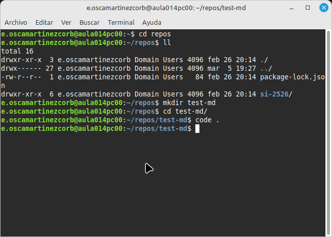

# Práctica 1. Administración de U24

## Ejercicio 1. Crea un usuario con `useradd`

Aquí vemos una ventana del terminal tras ejecutar `useradd`

```bash
sudo useradd -m dev01
```

Ahora vemos el resultado (una imagen qeu no se corresponde porque es una prueba):



Y aquí un [enlace a google](https://www.google.com)

> [!IMPORTANT]
> Crucial information necessary for users to succeed.

Fin!
